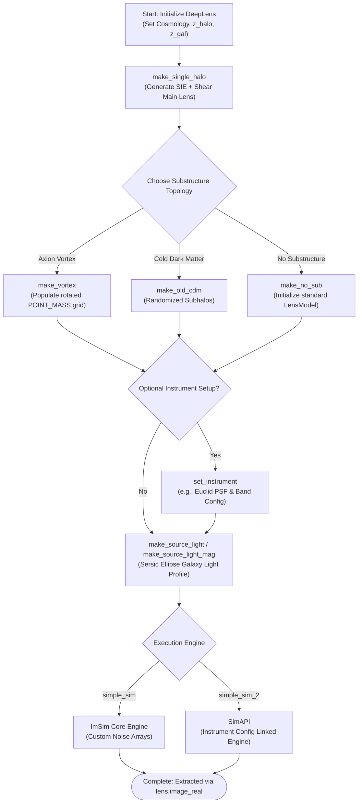

# DeepLenseSim Execution Architecture

## 1. Step-by-Step Execution Breakdown

The generation of a single simulated gravitational lensing image relies on a procedural pipeline utilizing the `DeepLens` class (found in `deeplense/lens.py`), which strings together methods from `astropy`, `pyHalo`, and `lenstronomy`.

1. **Initialization (`DeepLens`)**:
   - Sets cosmological parameters (Hubble constant `H0`, matter density `Om0`, baryon density `Ob0`).
   - Sets redshifts for the dark matter halo (`z_halo`) and the source galaxy (`z_gal`).
   - Initializes a cold dark matter (CDM) cone from `pyHalo` and stores the `axion_mass`.

2. **Main Halo Generation (`make_single_halo`)**:
   - Accepts the main dark matter halo `mass` and computes the Einstein radius.
   - Bootstraps the main lens model components (`SIE` - Singular Isothermal Ellipsoid, and `SHEAR`) into the Lenstronomy pipeline (`self.lens_model_list`).

3. **Substructure Configuration (Choose One)**:
   - **`make_vortex`**: Simulates Axion-like dark matter substructure (vortices) by calculating the de Broglie wavelength and populating an array of rotated `POINT_MASS` subhalos into the lens model list.
   - **`make_old_cdm`**: Populates standard point-source `CDM` subhalos randomly across the field of view based on a given beta slope and Poisson distribution.
   - **`make_no_sub`**: Just finalizes the `LensModel` class with no substructure.

4. **Instrument Setup (Optional - `set_instrument`)**:
   - Configures observational specifics (e.g., `inst_name='Euclid'`) by querying `lenstronomy.SimulationAPI.ObservationConfig`. It populates `self.kwargs_single_band` with noise, PSF, and magnitude constants for that specific telescope.

5. **Source Light Modeling (`make_source_light` / `make_source_light_mag`)**:
   - Configures the background galaxy's appearance, initializing a `SERSIC_ELLIPSE` light profile at a randomized center with fixed initial parameters.

6. **Simulation Execution (Choose One)**:
   - **`simple_sim`**: A basic simulator utilizing `lenstronomy.ImSim`. Sets a custom pixel grid and numerical transformations, calculates the ideal image block, and layers user-defined background RMS and Poisson noise (`image_util.add_poisson`).
   - **`simple_sim_2`**: A slightly more advanced wrapper utilizing `lenstronomy.SimulationAPI.sim_api`. Ties natively into `set_instrument` observation parameters.

7. **Final Output State**:
   - The resulting data arrays are stored as class attributes: `lens.image_real` (simulated image array with noise), `lens.image_model` (clean simulation), `lens.poisson`, and `lens.bkg` (background). Used downstream for dataset saving.

---

## 2. Execution Flowchart

---

## 3. Required Data Types for Core Parameters

When building the agentic wrapper or making automated pipeline requests to these methods, ensure the following strict types:

| Component | Target Parameter | Accepted Data Type | Example Value | Context |
| :--- | :--- | :--- | :--- | :--- |
| **`DeepLens()`** | `axion_mass` | `float` | `1e-24` | The axion mass in eV. Required if utilizing `make_vortex`. |
| **`DeepLens()`** | `H0`, `Om0`, `Ob0` | `float` | `70`, `0.3`, `0.05` | Astropy FlatLambdaCDM parameters. |
| **`DeepLens()`** | `z_halo`, `z_gal` | `float` | `0.5`, `1.0` | Redshifts. Note `z_gal` > `z_halo`. |
| **`make_single_halo()`** | `mass` | `float` | `1e12` | Main halo mass measured in solar masses. |
| **`make_vortex()`** | `vort_mass` | `float` | `3e10` | Total mass of the axion vortex in solar masses. |
| **`make_vortex()`** | `res` | `int` | `100` | Points of resolution to render the vortex across de Broglie coordinates. |
| **`set_instrument()`** | `inst_name` | `string` / `None` | `'Euclid'` | Supported lenstronomy configurations (capitalization-independent internally). |
